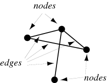

# Chapter 6 너비 우선 탐색
## 그래프(Graph)란?
`그래프(Graph)`란 연결의 집합을 모형화한 자료구조이다. 그래프는 `정점(Node)`, `간선(Edge)`로 이뤄지며 이를 통해 각 정점의 관계를 표현한다.

## 너비 우선 탐색(Breath-First Search, BFS)
너비 우선 탐색 알고리즘은 그래프를 대상으로 하는 알고리즘이다. 이 알고리즘은 어떠한 그래프에 대해 아래와 같은 문제를 푸는데에 해답을 찾을 수 있다.
> 1. 노드 A에서 노드 B로 가는 경로가 존재하는가?
> 2. 노드 A에서 노드 B로 가는 최단 경로는 무엇인가?

이러한 문제를 갈 수 있는 노드를 순회하며 찾는 알고리즘이 너비 우선 탐색이다.(여기서 너비는 노드를 탐색하는 우선순위 방식을 의미한다.) 

### 큐(Queue)
너비 우선 탐색 알고리즘에서 사용되는 자료구조로, `선입선출(FIFO)`을 유지하는 리스트형 자료구조를 말한다.
너비 우선 탐색 알고르즘에서는 다음에 갈 노드들을 저장하고 다음 반복에서 꺼내어 탐색하는 과정으로 진행되는데 이때 큐를 다음에 갈 노드를 저장하는 용도로 사용한다.

### 너비 우선 탐색 의사코드
그래프에서 특정 노드 찾기
1. 시작점에서 갈 수 있는 노드들을 큐에 넣는다.
2. 만약 큐가 비어 있으면 알고리즘을 종료하고 찾는 노드가 없다고 반환한다.
3. 큐에서 노드를 하나 꺼낸다 
4. 그 노드가 찾는 노드인지 확인 맞으면 반환하고 알고리즘을 종료한다.
5. 찾는 노드가 아니였다면, 그 노드의 인접 노드들을 큐에 넣는다.
6. 2단계로 돌아간다.

너비를 우선 탐색했기 때문에 여기서 찾아진 노드는 시작점에서 제일 최소 간선으로 연결된 노드가 된다.