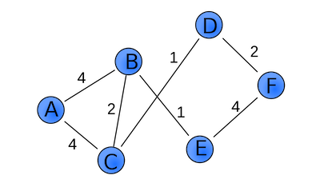

# Chapter 7 다익스트라 알고리즘
## 다익스트라(Dijkstra) 알고리즘이란?
이전 너비 탐색 알고리즘은 그래프의 엣지에 가중치가 없는 경우에만 사용할 수 있다.

위와 같은 각 엣지에 가중치 값이 있는 그래프에서는 최단 경로 탐색이 올바르게 동작하지 않게 된다. 이런 경우 다익스트라 알고리즘을 통해 해답을 얻을 수 있다.

### 다익스트라 알고리즘의 의사코드
1. 시작점 기준으로 모든 노드에 대해서 비용을 계산하여 표를 만든다. (이때 도달 할 수 없는 노드는 무한의 비용이 든다고 가정)
2. 만들어진 표에서 가장 적은 비용이 드는 노드를 기준으로 모든 노드에 대해서 또 다시 비용을 계산한다. 이때 만약 이전에 계산한 비용보다 작은 비용이 든다면 표에서 값을 갱신한다.
3. 2번 과정의 그래프 상의 모든 노드가 처리될때까지 반복한다.
4. 만들어진 표에서 원하는 노드의 값을 찾는다.

[Code](Dijkstra.kt)

### 예시
위에 첨부된 그래프 대상으로 `시작점 A`, `대상점 F`라고 하여 다익스트라 알고리즘을 적용해보자.

시작점 기준으로 모든 노드에 대한 비용을 계산하면 아래와 같은 표가 완성된다.

| 정점 | 비용 |
| --- | --- |
| B | 4 |
| C | 4 |
| D | `Inf` |
| E | `Inf` |
| F | `Inf` |

이 표에서 가장 비용이 적게 드는 노드는 `B`, `C`이다. 이 중 `B`를 대상으로 다시 비용을 계산 해보자.

| 정점 | 비용 |
| --- | --- |
| B | 4 |
| C | 4 |
| D | `Inf` |
| E | 5 |
| F | `Inf` |

그 다음 비용이 적게 드는 `C`에 대해서 계산하면 아래와 같다.

| 정점 | 비용 |
| --- | --- |
| B | 4 |
| C | 4 |
| D | 5 |
| E | 5 |
| F | `Inf` |

그 다음은 `D` `E` 중 `D`를 대상으로 계산하면 아래와 같다.

| 정점 | 비용 |
| --- | --- |
| B | 4 |
| C | 4 |
| D | 5 |
| E | 5 |
| F | 7 |

그 다음은 `D` `E` 중 `E`를 대상으로 계산하면 `F` 갈 수 있는 비용이 9가 나온다. 하지만 이미 `D`에서 계산한 7이 더 적은 비용이므로 갱신하지 않는다.

> 이렇게 모든 정점을 순회하고 표에서 `대상점 F`를 확인하면 7의 비용이 든다는 것을 알 수 있다.

만약이 해당 그래프에 대해서 `BFS`를 사용했다면 `A - B - E - F` 경로를 찾게 되어 비용 9가 최적의 경로라고 판단 했을 것이다. (비용을 고려하지 않고 최단 엣지만 계산하기 때문)

### 핵심 아이디어
가중치가 있는 그래프 문제를 보면 현재 갈 수 있는 노드의 비용보다 다른 노드를 거치면 더 작은 비용이 드는 상황이 발생한다는 것을 알 수 있다.
결국 이 문제가 가중치 그래프의 문제를 복잡하게 만드는 것인데 이를 하나의 원칙으로 해결 할 수 있다.
> 갈 수 있는 노드 중 제일 작은 비용이 드는 노드는 다른 노드를 거쳐도 갱신 될 수 없다.

이 말은 1단계에서 `A -> B`를 갈 수 있는 최저 비용은 4이였고 그 보다 작은 비용이 없기 때문에 4라는 비용이 갱신 될 수 없다는 것을 의미한다.
좀 더 자세히 말하자면 `A -> C -> ? -> ? -> B` 이런식의 경로가 존재하더라도 `A -> C`에서 이미 4의 비용이 들기 때문에 `A -> B`의 경로 비용보다 작을 수 없다는 것을 의미한다.

## 예외 상황
### 엣지의 가중치가 음수인 그래프
엣지의 가중치가 음수인 경우 위에서 말한 핵심 원칙이 깨질 수 있다.
> 갈 수 있는 노드 중 제일 작은 비용이 드는 노드가 음수인 엣지를 거쳐 갱신 될 수 있다.

이런 문제로 가중치가 음수인 그래프에서는 다익스트라 알고리즘을 쓸 수 없다. 대신 `벨만-포드 알고리즘(Bellman-Ford Algorithm)`을 적용해야 한다.